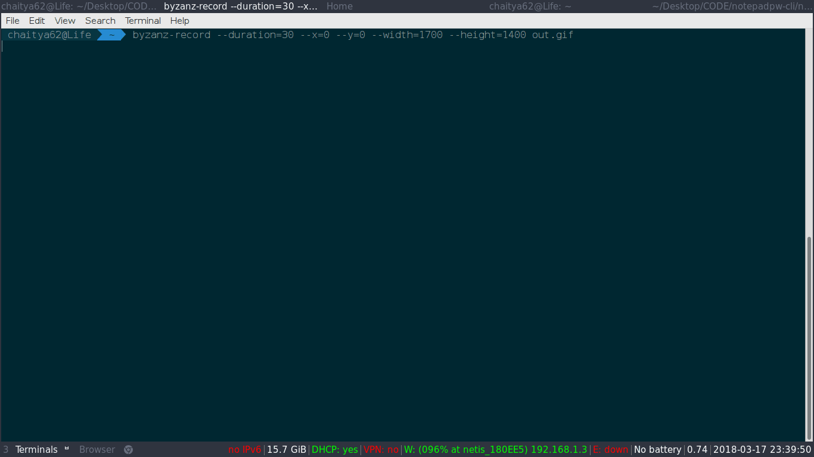

# Notepadpw CLI

[](https://www.python.org/)

A [notepad.pw](https://notepad.pw/about) magician in your command line


### Installing

To install the tool from pip

```sh
pip install npw

```

To install from source
first clone the repo

```
git clone https://github.com/Chaitya62/notepadpw-cli.git
cd notepadpw-cli
```
Than install the `requirements`

```sh

pip install -r requirements.txt

```
Now install the package by running the following commands

```

python setup.py build
python setup.py install

```

# Usage


To save contents of a file to https://notepad.pw/urlpath

```bash

npw -lo file_path urlpath

```

To watch the file for changes add `--watch` or `-w` flag

Example

```bash

npw -low file_path urlpath

```


To get the contents of a `urlpath` to a local file run the following command

```
npw -g file_path urlpath 

```

Note: Using other flags with g flag is redundant




## Known Issues

Windows doesn't support live reload - possible reason socketio is not supported 


## Contributing

Please reach out to me if you wish to contribute to this project


## Authors

* **Chaitya Shah**  - [Chaitya62](https://github.com/Chaitya62)

See also the list of [contributors](https://github.com/Chaitya62/notepadpw-cli/contributors) who participated in this project.

## License

This project is licensed under the GNU GENERAL PUBLIC LICENSE Version 3 - see the [LICENSE](./LICENSE) file for details


.
